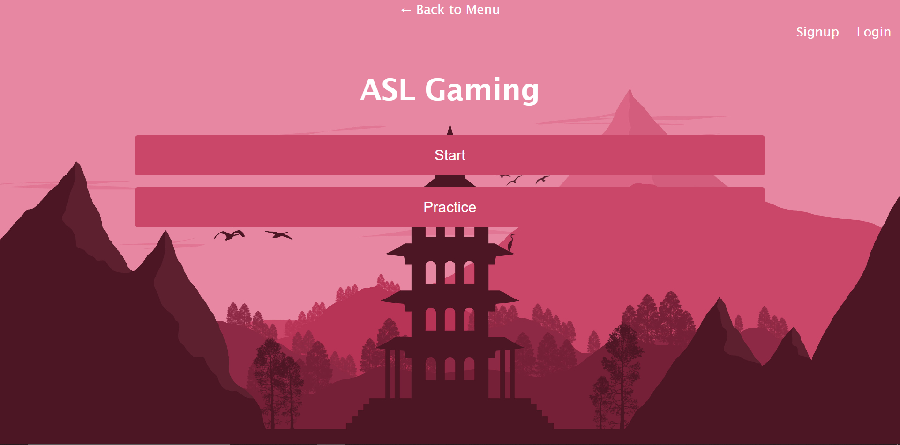

# ASL Gaming: A Fun Way To Learn

## Table of Contents

- [Description](#description)
- [Future](#future)
- [Installation](#installation)
- [Technologies](#technologies)
- [Image](#image)

## Description

This application allows for users to test their knowledge on American Sign Language through fun games. 

## Future
- Initially there is only one game atm but the potential for more games and quizzes is possible. 
- A user can signup and login atm but there isn't as much of a use for it atm. The potential to add a score keeper is in the works.

## Installation

Deployable website: https://asl-gaming.herokuapp.com/

## Technologies

- MERN
- GraphQL

## Image

